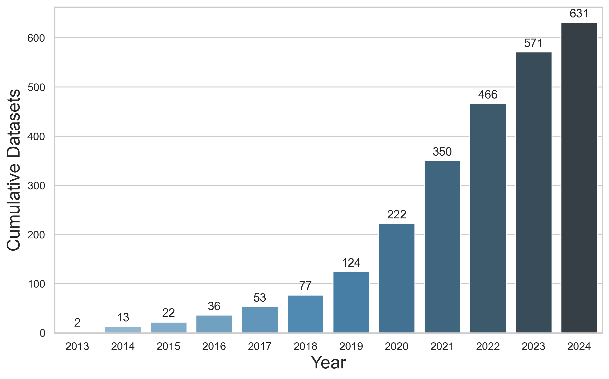
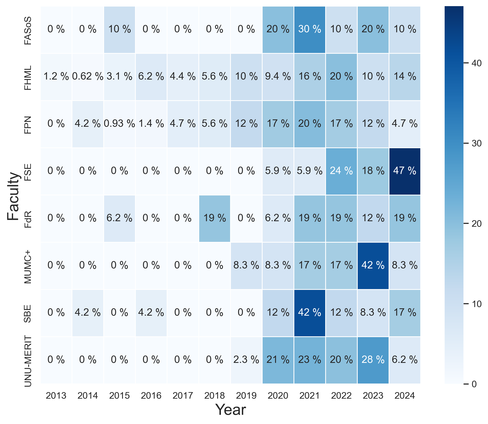

# Generating Reports on DataverseNL Usage

  

This repository contains a lightweight Python script to analyze, visualize and generate reports on [DataverseNL](https://dataverse.nl/) admin data. The objective is to get general statistics and an overview of the data publications within your institutional Dataverse in friendly formats (i.e. in Excel). It assumes a parent dataverse to work with. In this implementation, we are using, of course, the `root` URL for **Maastricht University Dataverse**.

This repository is maintained by the University Library, and it can be adapted to any Dataverse.
The main dependency that this code uses is `pyDataverse`, which is an API wrapper of the Dataverse's native API. The MIT licensed library [pyDataverse](https://pydataverse.readthedocs.io/en/latest/) is developed by Stefan Kasberger at AUSSDA - The Austrian Social Science Data Archive

## Usage

- To use this code, you will need to provide a token from your Dataverse repository, which should be placed in a file named `TOKEN.txt` in the same directory as the Python script/notebook. To generate a token go to your user account on [API Generation](https://dataverse.nl/dataverseuser.xhtml?selectTab=apiTokenTab) section.

- In your favorite code editor, you will execute the `generate_report_dataverse.py` script. Note that it does not accept parameters (at the moment - feel free to [create issues](https://github.com/MaastrichtU-Library/dataverse-analysis/issues)). You need to manually add the `root` URL of your parent dataverse. When you run it, it automatically does the data processing, and it generates an Excel report in a format shown in the following sample table

**Sample Output:** 
| faculty | department | sub_dataverse | year | date | persistentUrl |
|---|----|---|---|---|----|
| FHML | MHeNs  | No sub-dataverse | 2023 | 2023-09-04 | https://doi.org/10.34894/MEAMPK |
| FHML | KOALA | No sub-dataverse | 2017 | 2017-04-24 | https://doi.org/10.34894/XXKTHT |
| FHML | NUTRIM | No sub-dataverse | 2023 | 2023-01-09 | https://doi.org/10.34894/3TYPA4 |
| FHML | NUTRIM | BiGCaT  | 2013 | 2013-08-29 | https://doi.org/10.34894/IJWU5L |
| FHML | GROW | No sub-dataverse | 2018 | 2018-10-23 | https://doi.org/10.34894/BIU9RK |
| FHML | GROW | No sub-dataverse | 2022 | 2022-03-22 | https://doi.org/10.34894/LD03HF |
| FHML | MERLN | No sub-dataverse | 2020 | 2020-10-24 | https://doi.org/10.34894/K4VATI |
| FHML | MERLN | No sub-dataverse | 2020 | 2020-05-25 | https://doi.org/10.34894/8MONUL |

**Sample Visualizations:** 

## License

This code is released under the MIT License. See the [LICENSE](LICENSE) file for more details.

> The Software is provided "as is", without warranty of any kind, express or implied, including but not limited to the warranties of merchantability, fitness for a particular purpose and noninfringement. In no event shall the authors or copyright holders be liable for any claim, damages or other liability, whether in an action of contract, tort or otherwise, arising from, out of or in connection with the software or the use or other dealings in the software.

## Contact

If you have any questions, comments, or suggestions, please contact: [p.hernandezserrano@maastrichtuniversity.nl](mailto:p.hernandezserrano@maastrichtuniversity.nl)
